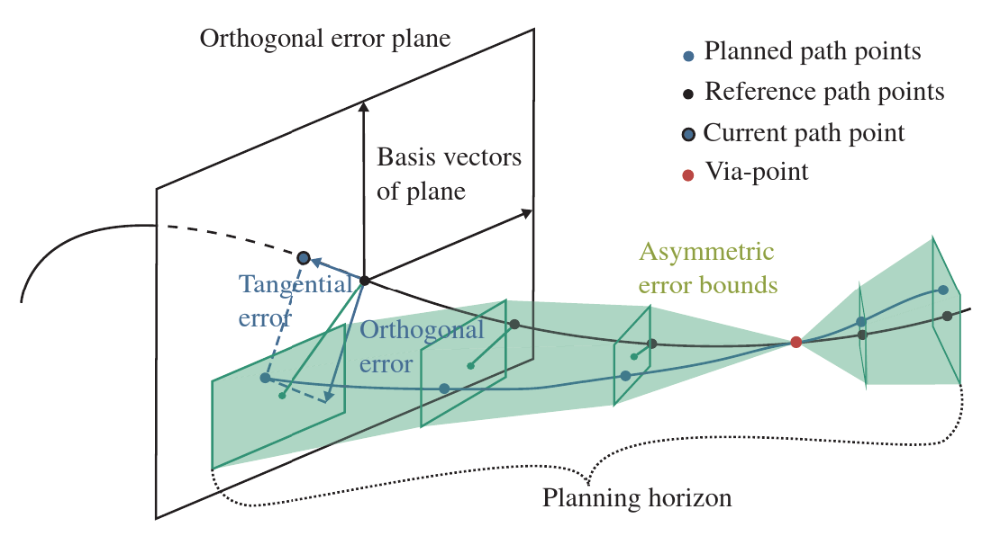

# BoundMPC

Implementation of the paper 
"BoundMPC: Cartesian Path Following with Error Bounds based on Model
Predictive Control in the Joint Space". 

Paper: [https://journals.sagepub.com/doi/10.1177/02783649241309354](https://journals.sagepub.com/doi/10.1177/02783649241309354)

Video: [https://www.acin.tuwien.ac.at/42d0/](https://www.acin.tuwien.ac.at/42d0/)



## Dependencies

We provide a docker container to run the example experiments. A working docker
installation with docker-compose is needed to use the docker container in this
repository. Installation instructions can be found on the [docker
website](https://docs.docker.com).

The implementation uses [ROS2 humble](https://docs.ros.org/en/humble/index.html)
for inter-proces-communication and [Casadi](https://web.casadi.org/) for the
automatic differentiation to provide the required analytical derivatives to the
[Ipopt](https://coin-or.github.io/Ipopt/) solver.

## Running the example experiments

In order to run the provided example you need to first build the docker
container using

```
docker build -t bound_mpc .
```

and then run the docker container with 

```
docker compose up
```

The docker container mounts the subdirectories of this repository which makes it
necessary to build the ROS workspace after the first time you build the
container. For this, run the following commands:

```
docker exec -it bound_mpc bash
colcon build --symlink-install
source install/setup.bash
```

The experiments are then run with

```
ros2 launch bound_mpc experiment1.launch.py
```

or

```
ros2 launch bound_mpc experiment2.launch.py
```

You should see an RViz window with a visualization of the robot during its
motion.

## Using BoundMPC in your work

If you want to use BoundMPC and adapt it to your specific needs, I recommend taking a look at the following files

- `bound_mpc/bound_mpc/BoundMPC/BoundMPC.py`
- `bound_mpc/bound_mpc/BoundMPC/casadi_ocp_formulation.py`

which contain the formulation of the OCP and how to call it. 
If you have any problems, feel free to open an issue.

## Real-time performance

The experiments do not run in real-time since the [HSL MA57
solver](https://www.hsl.rl.ac.uk/catalogue/hsl_ma57.html) is required for that.
This solver is not open source and in the interest of providing runable code to
everyone, we provide the implmentation without using the HSL MA57 solver.

## Troubleshooting

If you use Linux and do not see an RViz window you need to run 

```
xhost + 
```
